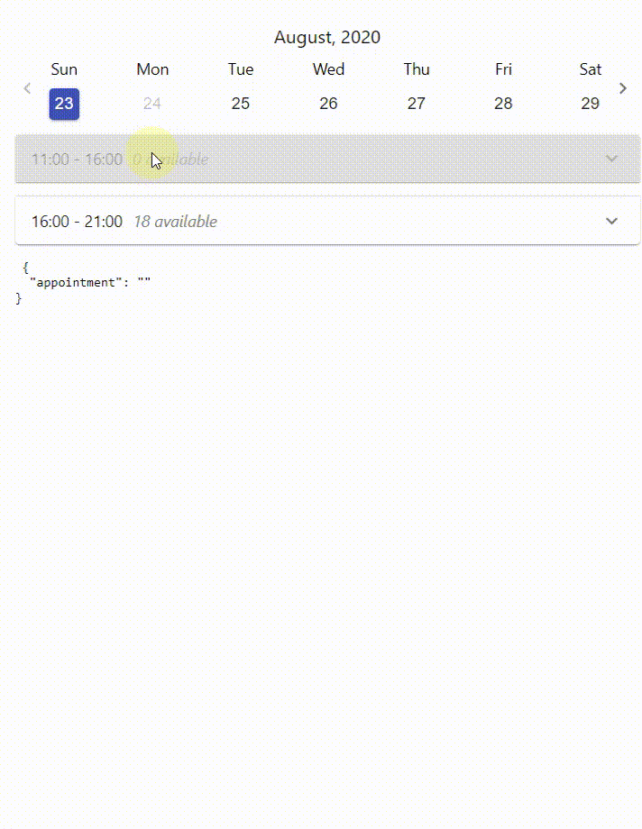

# WeekDateTimePicker
This is a simple date and time picker. It is a part of [Booking Form](https://github.com/devmc-ee/devmcee-booking) app
.  
 
The component is supposed to be inside of the [formik](https://formik.org/docs/overview) context for using its values 
and handlers.

Some functions are taken from the utils.js, that is used for holding general functions of the Booking Form.

Dates parsing,  formating and manipulation are powered by [momentjs](https://momentjs.com/) libs.

Calendar settings are stored in the external file DATA.js. Later it should be fetched from the backend

Available settings:
```javascript
 const CALENDAR_SETTINGS = {
	maxAvailableDays: 30,   // number of maximum days to show starting from today
	disabledWeekDays: [1],  // disable weekdays on every week (day-off) 
	workingTime: {          // salon working time, or all available times range 
		start: '11:00',
		end: '21:00'
	},
	timeStep: 15,           // minimal time step, that devides the time range on steps (slots)
	minimalBreak: 15,
	todaysFirstTimeOffset: 60,  // if date is today, then this offset is added to the current time to show first  slot
	timeSlotGroups: [       // combines all timeslots into these groups. Used for accordion
		{
			start: '11:00',
			end: '16:00'
		},

		{
			start: '16:00',
			end: '21:00'
		}],
	locale: 'en',           // translation
	timeZone: 'Europe/Tallinn',
    disabledDates: ['2020-08-29'],
    dateFormat: 'YYYY-MM-DD'

};
```

The last available timeslots are defined by the duration of the selected services. In other words, the last 
available time is the end of the working time - serviceDuration. 

Visual icons and components, like an accordion, are taken from [Material-Ui](https://material-ui.com/) library


This project was bootstrapped with [Create React App](https://github.com/facebook/create-react-app).

Component repository: 
```
https://github.com/devmc-ee/weekdate-time-picker-reactjs.git

```
